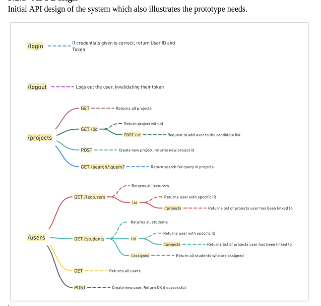
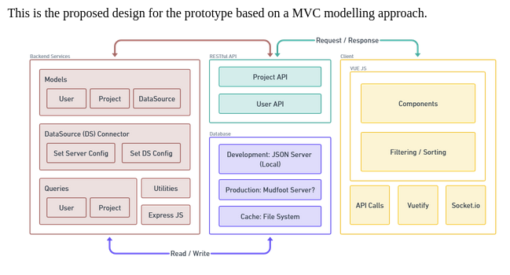
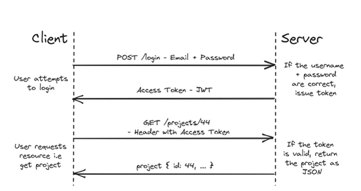
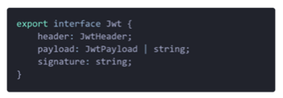
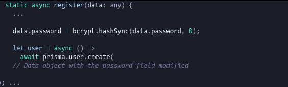

# Table of Content
- [Table of Content](#table-of-content)
- [Description](#description)
  - [Potential impact of developing PWA app for project allocation](#potential-impact-of-developing-pwa-app-for-project-allocation)
- [Design](#design)
  - [API Design](#api-design)
  - [MVP Design](#mvp-design)
  - [Framework/Language Choices](#frameworklanguage-choices)
  - [Security](#security)
    - [JSON Web Tokens (JWT)](#json-web-tokens-jwt)
    - [Bcrypt](#bcrypt)
  - [Other Utilities](#other-utilities)
    - [Live-Server – Nodemon](#live-server--nodemon)
    - [Logging – Winston](#logging--winston)
    - [Improved WebSockets - Socket.io](#improved-websockets---socketio)

# Description
This project addresses the need for mobile device support in the final year project selection process by developing a mobile-friendly platform. The platform will be responsive and accessible on various mobile devices, providing students with a user-friendly interface to browse, search, and filter available project topics. 

Implementing this platform will improve efficiency and enhance student experience during project selection. Potential challenges and considerations will be discussed, such as user interface design, data security, and system integration. 

Embracing this digital transformation will help universities stay updated with evolving technology and student preferences while streamlining the final-year project selection process. 

## Potential impact of developing PWA app for project allocation 

Progressive Web Applications (PWAs) have the potential to revolutionise the project allocation experience for students and lecturers. PWAs overcome many limitations associated with traditional web-based platforms and native mobile applications, such as cross-platform compatibility, improved user experience, and simplified deployment and maintenance. 

- Cross-platform compatibility ensures that all users can access project assignments seamlessly, regardless of device preferences. 
- Improved user experience fosters engagement and encourages active participation. 
- Simplified deployment and maintenance ensure that educators can focus more on content creation and teaching than dealing with technical complexities. 

In conclusion, using PWAs for this project offers several advantages to improve the project allocation experience for students and lecturers. By leveraging the strengths of PWAs, educational institutions can create more engaging and practical experiences for their students. 

# Design
## API Design

## MVP Design

## Framework/Language Choices 
The purpose of the prototype is to showcase the app's key value proposition and gather feedback as quickly as possible. Several crucial factors were considered: 

- Speed of development: The chosen framework should enable rapid iteration and quick implementation of key features to minimise development time and maximise the effectiveness of user testing and feedback collection. 
- Simplicity and clarity: Allow for the prototype to be simple and focused, avoiding unnecessary complexity or distracting features. 
- Scalability and Maintainability: While speed is important for prototyping, it's also essential to consider the app's long-term potential.

This project has a few non-negotiable aspects that will affect the languages/frameworks shortlisted. 
- TypeScript (TS) will be utilised due to familiarity and extensive support within the development community. TS also provides a type system (including generics). 
- The chosen language or framework must provide robust debugging tools to ensure efficient troubleshooting. 
- It is also essential to have a framework or language that enables component reusability, allowing for efficient and scalable development practices. 
After research, two frameworks have been shortlisted: Vue.js and Next.js. 

We found that Next.js is a powerful framework but may introduce unnecessary complexity, hence it's better suited for more complex applications. Vue.js is known for its simplicity, easy-to-understand structure, and effectiveness in handling small to medium-sized applications. It is lightweight and highly customisable, which allows the creation of sophisticated applications.  

In conclusion, Vue.js is the best choice for the prototype, as it perfectly aligns with factors stated above and the project's specific requirements. 

## Security 
For this project, we briefly consider security measures that would comply with Section 3.1.1 Privacy and Confidentiality.  

Due to time constraints, not all potential avenues to secure the application have been thoroughly considered. We have defined that: (1) securing access to the application, and (2) minimising an attack vector (password), are the key requirements to implement for this prototype, given our time constraint. 

### JSON Web Tokens (JWT) 
JSON Web Tokens (JWTs) is a compact and secure method used to implement authentication and authorisation in this project. 

Above shows when a user logs in, the server generates a JWT containing relevant user information. This token consists of three parts: the header, payload, and signature. The header specifies the signing algorithm, the payload contains user data, and the signature ensures the token's integrity (as seen in below)

The JWT is then sent to the client, which can store it for subsequent requests. When the client makes a request, it includes the JWT in the request headers. The server verifies the token's authenticity and extracts the user data. JWTs offer advantages like statelessness and decentralised verification ​(Schenkelman, 2014)​.  
However, security measures are recommended such as token expiration and token revocation, which is not within the scope of developing the prototype. 

### Bcrypt 
Bcrypt is a password-hashing function that is based on the Blowfish cipher; it is considered to be one of the most secure password-hashing functions available ​(Saturn Cloud, 2023)​. It is a one-way function that cannot be reversed to reveal the original password, and it uses a salt to make it more difficult for attackers to use rainbow tables, which is a password cracking method ​(Beyond Identity, n.d.)​.  

The strength of bcrypt depends on the “cost factor”, which controls how many times the hash is computed; higher the cost factor, the more secure the hash will be, but it will take longer to calculate ​(Arias, 2021)​.  

See image below, here Bcrypt has been used in this project for when a user registers; their password is not stored in its original form in the database for security purposes, instead it is hashed using bcrypt.hashSync with a salt length of 8.  

To note that 8 is the minimum salt available and has been used for development as the current machine being used as the server would not be able to match the performance of a dedicated server in processing the hash. 

## Other Utilities
### Live-Server – Nodemon 
During development, a pain point arose in the fact that the backend server needed to be manually restarted to propagate changes. This took a lot of development time away and became quite frustrating. This led to implementing Nodemon, which is a utility that helps develop Node.js-based applications by automatically restarting the node application when file changes are detected in the directory. 

### Logging – Winston 
Logging began as using console logs to read request data and the response when an API call was made. This proved to be clunky and did not provide formatting options to improve clarity, which led to implementing Winston, a library for Node.js which allows for messages to be logged to various destinations, including files, consoles, and databases. Winston has been configured to tag date and time onto the log along with its type, i.e., if it’s an error or HTTP response. 

### Improved WebSockets - Socket.io 
As part of this project’s objective to allow for real-time notifications, an improved version of WebSockets was implemented. Socket.IO is a library that facilitates real-time, bi-directional communication between web clients and servers​. It operates on top of the WebSocket protocol and offers added assurances, such as fallback to HTTP long polling or automatic reconnection​. 

We found, when a new Socket.IO server is created, it is considered separate to the express server, so the cors:origin header had to be specified in the response to allow cross-origin requests.